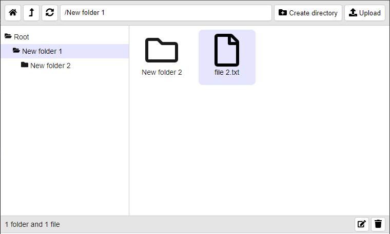

# react-file-manager-ui
React UI component for handling files and folders




Usage:
```js
<FileManager
    getList={getList}
    createDirectory={createDirectory}
    deletePaths={deletePaths}
    openFile={openFile}
    uploadFiles={uploadFiles}
    rename={rename}
    getDownloadLink={getDownloadLink}
    getFileSizeBytes={getFileSizeBytes}
    getFileChangedDate={getFileChangedDate}
    features={['createDirectory', 'uploadFiles', 'deletePaths', 'rename']}
/>
```

## features

features can be enabled or disabled

if features are not defined then all features are enabled

## height

height is 100vh by default

## getList

**getList** will receive path and should return promise that would be resolved with next data model:
 ```json
[
    { name: 'New folder 1', type: 2 },
    { name: 'file.txt', type: 1 }
]
```
where type 1 is file and type 2 is folder

## createDirectory

**createDirectory**  will receive current path and should return promise that would be resolved when directory is created

## deletePaths

**deletePaths**  will receive array of paths and should return promise that would be resolved when paths are deleted

## rename

**rename**  will receive path and should return promise that would be resolved when it's renamed

## uploadFiles

**uploadFiles**  will receive current path and array of files and should return promise that would be resolved when files are uploaded

## openFile

**openFile**  will receive path

## getDownloadLink

**getDownloadLink**  will receive current path and should return a link for downloading the file represented by that path

## getFileSizeBytes

**getFileSizeBytes**  will receive current path and should return its size in bytes if applicable

## getFileChangedDate

**getFileChangedDate**  will receive current path and should return its last modification date if applicable
